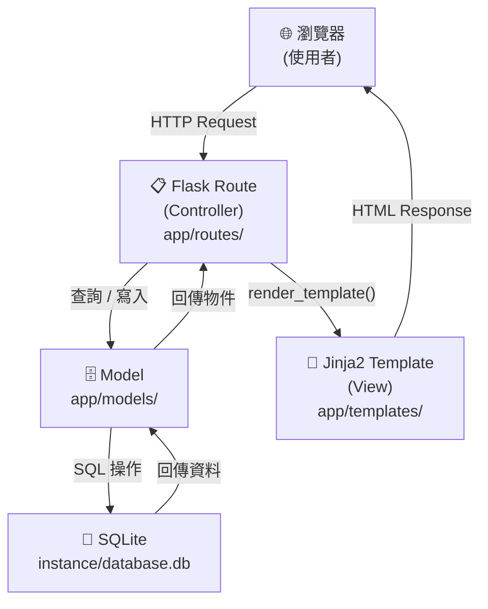

# 系統架構文件：食譜收藏夾 (Recipe Collection System)

> 根據 `docs/PRD.md` 產出，技術限制：Python + Flask、Jinja2、SQLite。

---

## 1. 技術架構說明

### 1.1 選用技術與原因

| 技術 | 用途 | 選用原因 |
|------|------|----------|
| **Python 3** | 後端語言 | 語法簡潔、生態豐富，適合快速開發 |
| **Flask** | Web 框架 | 輕量、彈性高，非常適合 MVP 與小型專案 |
| **Jinja2** | HTML 模板引擎 | Flask 內建整合，支援模板繼承與動態渲染 |
| **SQLite** | 資料庫 | 零設定、單一檔案，快速輕量，適合 MVP 開發 |
| **SQLAlchemy** | ORM | 透過物件操作資料庫，避免直接撰寫 SQL，降低 SQL Injection 風險 |
| **HTML / CSS / JS** | 前端 | 搭配 Jinja2 一起渲染，支援 RWD 行動端瀏覽 |

### 1.2 Flask MVC 模式說明

本專案採用 **MVC（Model / View / Controller）** 設計模式：

| 角色 | 對應位置 | 職責 |
|------|----------|------|
| **Model** | `app/models/` | 定義資料表結構（食譜、分類），與資料庫互動 |
| **View** | `app/templates/` | Jinja2 HTML 模板，負責呈現使用者介面 |
| **Controller** | `app/routes/` | Flask 路由函式，接收請求、呼叫 Model、回傳 View |

```
使用者請求 → Controller（routes）→ Model（models）→ 資料庫
                    ↓
              View（templates）→ 回傳 HTML 給使用者
```

---

## 2. 專案資料夾結構

```
recipe_collection/          ← 專案根目錄
│
├── app/                    ← 主要應用程式套件
│   ├── __init__.py         ← 建立 Flask app、初始化資料庫
│   │
│   ├── models/             ← 資料庫模型（Model 層）
│   │   ├── __init__.py
│   │   ├── recipe.py       ← Recipe 食譜資料表模型
│   │   └── category.py     ← Category 分類資料表模型
│   │
│   ├── routes/             ← Flask 路由（Controller 層）
│   │   ├── __init__.py
│   │   ├── recipe.py       ← 食譜 CRUD 路由（新增、編輯、刪除、檢視）
│   │   ├── search.py       ← 關鍵字搜尋路由
│   │   ├── category.py     ← 分類管理路由
│   │   └── share.py        ← 食譜分享（產生唯讀連結）路由
│   │
│   ├── templates/          ← Jinja2 HTML 模板（View 層）
│   │   ├── base.html       ← 共用版面（導覽列、頁尾）
│   │   ├── index.html      ← 首頁：食譜列表
│   │   ├── recipe/
│   │   │   ├── create.html ← 新增食譜表單
│   │   │   ├── edit.html   ← 編輯食譜表單
│   │   │   ├── detail.html ← 食譜詳情頁
│   │   │   └── share.html  ← 分享唯讀頁
│   │   ├── category/
│   │   │   ├── list.html   ← 分類列表
│   │   │   └── create.html ← 新增分類表單
│   │   └── search/
│   │       └── results.html← 搜尋結果頁
│   │
│   └── static/             ← 靜態資源（前端）
│       ├── css/
│       │   └── style.css   ← 自訂樣式（含 RWD 設計）
│       ├── js/
│       │   └── main.js     ← 前端互動邏輯（非必要）
│       └── uploads/        ← 使用者上傳的食譜圖片（Nice to Have）
│
├── instance/               ← 執行期產生的資料（不納入版本控制）
│   └── database.db         ← SQLite 資料庫檔案
│
├── docs/                   ← 專案文件
│   ├── PRD.md              ← 產品需求文件
│   └── ARCHITECTURE.md     ← 本架構文件
│
├── app.py                  ← 應用程式進入點（啟動 Flask server）
├── config.py               ← 設定檔（SECRET_KEY、資料庫路徑等）
└── requirements.txt        ← Python 套件清單
```

---

## 3. 元件關係圖

### 3.1 請求處理流程



### 3.2 模組依賴關係

```
app.py
  └── app/__init__.py
        ├── app/routes/recipe.py    ─ 依賴 ─► app/models/recipe.py
        ├── app/routes/search.py    ─ 依賴 ─► app/models/recipe.py
        ├── app/routes/category.py  ─ 依賴 ─► app/models/category.py
        └── app/routes/share.py     ─ 依賴 ─► app/models/recipe.py
```

---

## 4. 關鍵設計決策

### 決策 1：採用 Blueprint 拆分路由

**做法**：將食譜、搜尋、分類、分享各自定義為獨立的 Flask Blueprint，在 `app/__init__.py` 中統一 `register_blueprint()`。

**原因**：避免所有路由堆在單一檔案造成混亂，未來擴充（例如新增會員系統）只需新增 Blueprint 即可。

---

### 決策 2：使用 SQLAlchemy ORM 而非裸 SQL

**做法**：透過 `flask-sqlalchemy` 定義 Model 類別，以 Python 物件操作資料。

**原因**：
- 降低撰寫錯誤 SQL 的風險
- 自動防範 SQL Injection
- 方便日後換用 PostgreSQL 等資料庫（只需修改連線設定）

---

### 決策 3：模板繼承（Template Inheritance）統一版面

**做法**：所有頁面繼承 `base.html`，在 `` 中填入各頁內容。

**原因**：
- 導覽列、頁首、頁尾只需維護一份
- 確保整體 UI 一致性，減少重複 HTML

---

### 決策 4：分享功能採用唯讀頁面 + UUID 連結

**做法**：每筆食譜在建立時產生一組 UUID 作為 `share_token`，分享連結格式為 `/share/<share_token>`，該頁面不允許編輯。

**原因**：
- 簡單安全，不需要登入機制也能控制分享範圍
- 連結具唯一性，難以被猜測（相比純數字 ID）

---

### 決策 5：圖片上傳暫列 Nice to Have，先以 URL 欄位替代

**做法**：MVP 階段食譜圖片欄位儲存外部圖片 URL（字串），待後續版本再實作檔案上傳至 `static/uploads/`。

**原因**：
- 降低 MVP 複雜度，快速上線驗證核心功能
- 避免早期就需處理檔案系統權限、大小限制等問題

---

## 5. 安全考量摘要

| 風險 | 對應措施 |
|------|----------|
| XSS 攻擊 | Jinja2 預設自動轉義 HTML 特殊字元 |
| SQL Injection | 使用 SQLAlchemy ORM，不直接拼接 SQL |
| CSRF | 使用 `flask-wtf` 的 CSRF Token 保護表單 |
| 敏感設定外洩 | `SECRET_KEY` 等設定放於 `config.py`，不提交到版本控制 |

---

*文件版本：v1.0 — 2026-04-28*
