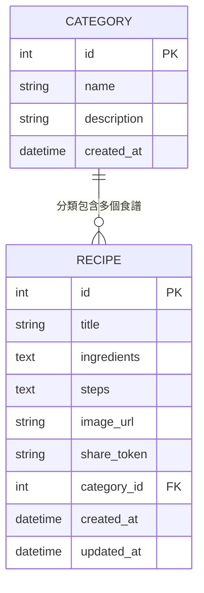

# 資料庫設計文件：食譜收藏夾 (Recipe Collection System)

> 根據 `docs/PRD.md`、`docs/ARCHITECTURE.md`、`docs/FLOWCHART.md` 產出。

---

## 1. ER 圖（實體關係圖）

---

## 2. 資料表詳細說明

### 2.1 `categories`（食譜分類）

| 欄位名稱 | 型別 | 必填 | 說明 |
|----------|------|------|------|
| `id` | INTEGER | ✅ | 主鍵，自動遞增 |
| `name` | TEXT | ✅ | 分類名稱（如：甜點、素食、家常菜），需唯一 |
| `description` | TEXT | ❌ | 分類的補充說明 |
| `created_at` | DATETIME | ✅ | 建立時間，預設為當下時間 |

- **Primary Key**：`id`
- **Unique**：`name`（避免重複分類名稱）

---

### 2.2 `recipes`（食譜）

| 欄位名稱 | 型別 | 必填 | 說明 |
|----------|------|------|------|
| `id` | INTEGER | ✅ | 主鍵，自動遞增 |
| `title` | TEXT | ✅ | 食譜標題 |
| `ingredients` | TEXT | ✅ | 食材清單（以換行分隔的文字） |
| `steps` | TEXT | ✅ | 烹飪步驟（以換行分隔的文字） |
| `image_url` | TEXT | ❌ | 食譜圖片 URL（MVP 階段不上傳檔案） |
| `share_token` | TEXT | ✅ | 分享用的 UUID，全域唯一，用於唯讀連結 |
| `category_id` | INTEGER | ❌ | 外鍵，參照 `categories.id`，可為 NULL（未分類） |
| `created_at` | DATETIME | ✅ | 建立時間，預設為當下時間 |
| `updated_at` | DATETIME | ✅ | 最後更新時間 |

- **Primary Key**：`id`
- **Foreign Key**：`category_id` → `categories(id)`（ON DELETE SET NULL）
- **Unique**：`share_token`

---

## 3. 資料表關聯說明

- **`categories` 與 `recipes`**：一對多（One-to-Many）
  - 一個分類可以包含零至多個食譜
  - 一個食譜最多屬於一個分類（可以為「未分類」）
  - 若分類被刪除，食譜的 `category_id` 自動設為 `NULL`

---

## 4. 索引設計

| 索引名稱 | 資料表 | 欄位 | 用途 |
|----------|--------|------|------|
| `idx_recipes_category_id` | `recipes` | `category_id` | 加速依分類篩選查詢 |
| `idx_recipes_share_token` | `recipes` | `share_token` | 加速分享頁面查詢 |
| `idx_recipes_title` | `recipes` | `title` | 加速關鍵字搜尋 |

---

*文件版本：v1.0 — 2026-04-28*
