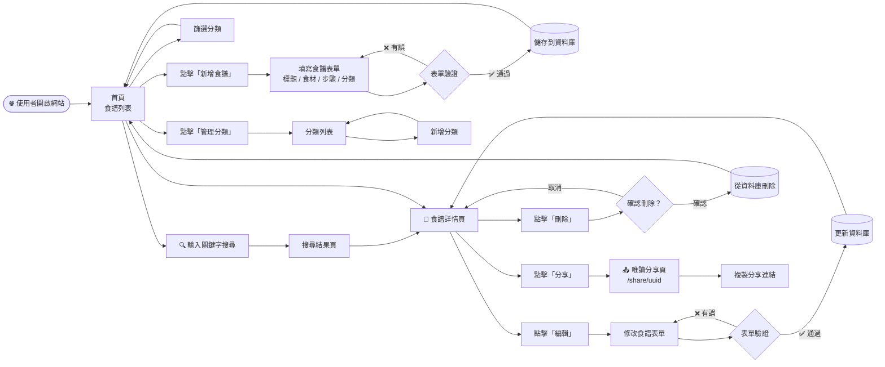
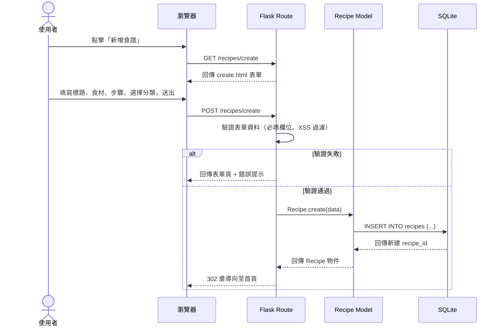
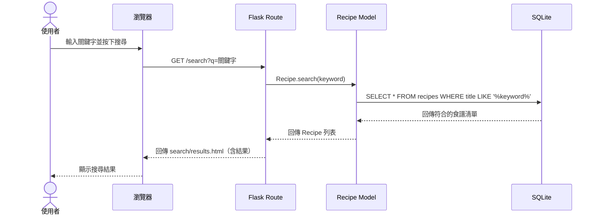
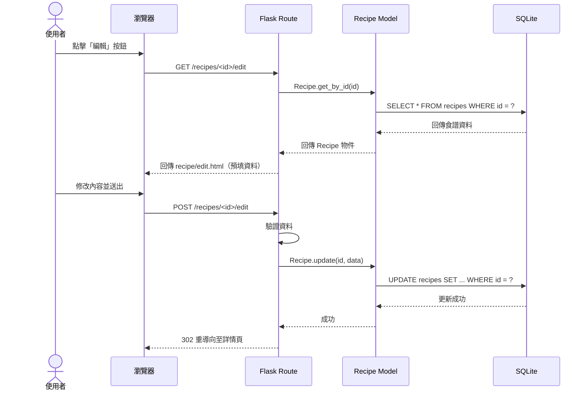
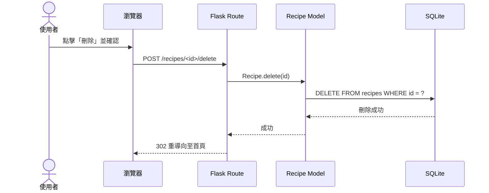
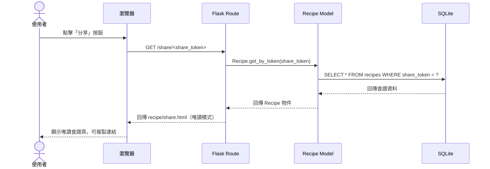

# 流程圖文件：食譜收藏夾 (Recipe Collection System)

> 根據 `docs/PRD.md` 與 `docs/ARCHITECTURE.md` 產出，使用 Mermaid 語法繪製。

---

## 1. 使用者流程圖（User Flow）

描述使用者從進入網站到完成各項操作的完整路徑。

---

## 2. 系統序列圖（Sequence Diagram）

描述每個主要操作在系統內部（瀏覽器 → Flask → Model → SQLite）的完整資料流。

### 2.1 新增食譜

### 2.2 搜尋食譜

### 2.3 編輯食譜

### 2.4 刪除食譜

### 2.5 分享食譜（唯讀連結）

---

## 3. 功能清單對照表

| 功能 | URL 路徑 | HTTP 方法 | 說明 |
|------|----------|-----------|------|
| 首頁 / 食譜列表 | `/` | GET | 顯示所有食譜，支援分類篩選 |
| 新增食譜（表單頁） | `/recipes/create` | GET | 顯示新增食譜表單 |
| 新增食譜（送出） | `/recipes/create` | POST | 接收表單資料，寫入資料庫 |
| 食譜詳情 | `/recipes/<id>` | GET | 顯示單筆食譜完整內容 |
| 編輯食譜（表單頁） | `/recipes/<id>/edit` | GET | 顯示預填資料的編輯表單 |
| 編輯食譜（送出） | `/recipes/<id>/edit` | POST | 接收修改資料，更新資料庫 |
| 刪除食譜 | `/recipes/<id>/delete` | POST | 刪除指定食譜 |
| 搜尋食譜 | `/search` | GET | 接收 `?q=` 參數，回傳搜尋結果 |
| 分享食譜（唯讀） | `/share/<share_token>` | GET | 以 UUID token 顯示唯讀食譜頁 |
| 分類列表 | `/categories` | GET | 顯示所有分類 |
| 新增分類（表單頁） | `/categories/create` | GET | 顯示新增分類表單 |
| 新增分類（送出） | `/categories/create` | POST | 寫入新分類到資料庫 |

---

*文件版本：v1.0 — 2026-04-28*
